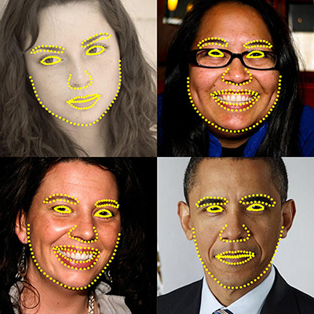

# Face alignment using OpenCV

 

* Face alignment is a computer vision technology for identifying the geometric structure of human faces in digital images. Given the location and size of a face, it automatically determines the shape of the face components such as eyes and nose.

The main aim of the project is an implementation of an excellent paper from this year's Computer Vision and Pattern Recognition Conference: One Millisecond Face Alignment with an Ensemble of Regression Trees by Vahid Kazemi and Josephine Sullivan

All discussion regarding the project can be found at opencv face alignment slack channel:

https://open-cv.slack.com/messages/C5HGCM4PR/

I have tried to provide this functionality to OpenCV. This is a tutorial describing how to use it.
[use it today](#usage). 

## Usage

The face alignment functionality is provided in OpenCV contrib. 
To use this you have to download and install OpenCV and build it along with contrib modules.

1. Follow this link to install OpenCV along with OpenCV contrib : http://docs.opencv.org/trunk/d7/d9f/tutorial_linux_install.html

2. After installing OpenCV along with contrib modules you can directly use the following samples :

		1. sample_train_landmark_detector.cpp for training your own face landmark detector.
		2. sampleDetectLandmarks.cpp for detecting landmarks in a given image.
		3. sampleDetectLandmarksvideo.cpp for detecting landmarks in a video.
		4. sampleFaceSwapping.cpp for swapping faces in 2 images.
		5. sampleFaceLapseSequence.cpp to create a face lapse sequence from a set of images.
The details for using them are [here](#Tutorial)
## Tutorial

To understand the usage and code of the samples. Jump [here](https://sukhad-app.github.io/final)

## Roadmap

See the [pull request](https://github.com/opencv/opencv_contrib/pull/1199) for discussion regarding various issues (and known issues).

## Project philosophy

The Hacker theme is intended to make it quick and easy for GitHub Pages users to create their first (or 100th) website. The theme should meet the vast majority of users' needs out of the box, erring on the side of simplicity rather than flexibility, and provide users the opportunity to opt-in to additional complexity if they have specific needs or wish to further customize their experience (such as adding custom CSS or modifying the default layout). It should also look great, but that goes without saying.

## Contributing

Please read before starting work on a pull request: https://github.com/opencv/opencv/wiki/How_to_contribute

Summary of guidelines:

One pull request per issue;
Choose the right base branch;
Include tests and documentation;
Clean up "oops" commits before submitting;
Follow the coding style guide.

