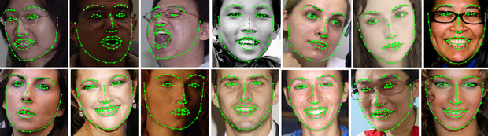

# [](#header-1)Training face landmark detector

This tutorial will explain the sample code for face landmark detection. Jumping directly to the code :

```
CascadeClassifier face_cascade;
Mat img = imread(image);
face_cascade.load(cascade_name);
Ptr<FacemarkKazemi> facemark= createFacemarkKazemi(face_cascade);
facemark->load(filename);
```
The above code creates a pointer of the face landmark detection class. A Cascade classifier
has to be passed to it for detecting faces while landmark detection. The above code also loads the image
in which landmarks have to be detected.

```
vector<Rect> faces;
resize(img,img,Size(460,460));
facemark->getFaces(img,faces);
vector< vector<Point2f> > shapes;
shapes.resize(faces.size());
```
The above code creates a vector to store the detected faces. It then resizes the image to a smaller size as
processing speed is faster with small images. It then creates a vector of vector to store shapes for each
face detected.

```
if(facemark->getShape(img,faces,shapes))
{
for( size_t i = 0; i < faces.size(); i++ )
{
    cv::rectangle(img,faces[i],Scalar( 255, 0, 0 ));
}
for(unsigned long i=0;i<faces.size();i++){
    for(unsigned long k=0;k<shapes[i].size();k++)
        cv::circle(img,shapes[i][k],5,cv::Scalar(0,0,255),FILLED);
}
namedWindow("Detected_shape");
imshow("Detected_shape",img);
waitKey(0);
}
```

The above code then calls the function getShape to get shapes of all detected faces in the image
and then draws the rectangles bounding the faces and marks the desired landmarks. 
[back](./)
