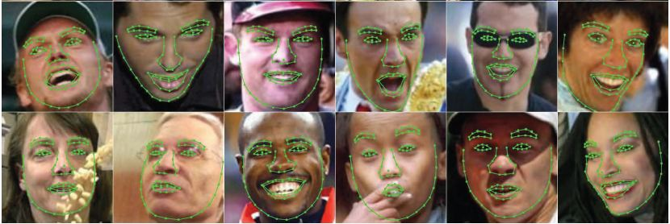
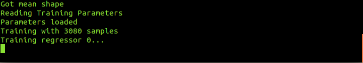

# [](#header-1)Training face landmark detector

This tutorial will explain the sample code for training face landmark detector. Jumping directly to the code :

```C++
CascadeClassifier face_cascade;
bool myDetector( InputArray image, OutputArray ROIs );

bool myDetector( InputArray image, OutputArray ROIs ){
    Mat gray;
    std::vector<Rect> faces;
    if(image.channels()>1){
        cvtColor(image.getMat(),gray,CV_BGR2GRAY);
    }
    else{
        gray = image.getMat().clone();
    }
    equalizeHist( gray, gray );
    face_cascade.detectMultiScale( gray, faces, 1.1, 3,0, Size(30, 30) );
    Mat(faces).copyTo(ROIs);
    return true;
}
```
The facemark API provides the functionality to the user to use their own face detector to be used in training.The above code creartes a sample face detector. The above function would be passed to a function pointer in the facemark API.

```C++
vector<String> filenames;
glob(directory,filenames);
```
The above code creates a vector filenames for storing the names of the .txt files as described [here](index)
It gets the filenames of the files in the directory.

```C++
Mat img = imread(image);
face_cascade.load(cascade_name);
FacemarkKazemi::Params params;
params.configfile = configfile_name;
Ptr<Facemark> facemark = FacemarkKazemi::create(params);
facemark->setFaceDetector(myDetector);

```
The above code creates a pointer of the face landmark detection class. The face detector created above has to be passed
as function pointer to the facemark pointer created for detecting faces while training the model.

```C++
vector<String> imagenames;
vector< vector<Point2f> > trainlandmarks,Trainlandmarks;
vector<Mat> trainimages;
loadTrainingData(filenames,trainlandmarks,imagenames);
for(unsigned long i=0;i<300;i++){
string imgname = imagenames[i].substr(0, imagenames[i].size()-1);
string img = directory + string(imgname) + ".jpg";
Mat src = imread(img);
if(src.empty()){
    cerr<<string("Image "+img+" not found\n.")<<endl;
    continue;
}
trainimages.push_back(src);
Trainlandmarks.push_back(trainlandmarks[i]);
}
```
The above code creates std::vectors to store the images and their corresponding landmarks. 
The above code calls a function loadTrainingData to load the landmarks and the images into their respective vectors.

If the dataset you downloaded is of the following format :
```
version: 1
n_points:  68
{
 115.167660 220.807529
 116.164839 245.721357
 120.208690 270.389841
  ...
}
This is the example of the dataset available at https://ibug.doc.ic.ac.uk/resources/facial-point-annotations/

```

Then skip the above code for loading training data and use the following code. This sample is provided as sampleTrainLandmarkDetector2.cpp
in the face module in opencv contrib.

```C++
std::vector<String> images;
std::vector<std::vector<Point2f> > facePoints;
loadTrainingData(imagesList, annotations, images, facePoints, 0.0);
```

In the above code imagelist and annotations are the file of following format :
```
example of contents for images.txt:
../trainset/image_0001.png
../trainset/image_0002.png
example of contents for annotation.txt:
../trainset/image_0001.pts
../trainset/image_0002.pts
```

These symbolize the names of images and their corresponding annotations. 

The above code scales images and landmarks as training on images of smaller size takes less time.
This is because processing larger images requires more time. After scaling data it calculates mean
shape of the data which is used as initial shape while training.

Finally call the following function to perform training :

```C++
facemark->training(Trainimages,Trainlandmarks,configfile_name,scale,modelfile_name);
```
In the above function scale is passed to scale all images and the corresponding landmarks so that the size of all 
images can be reduced as it takes greater time to process large images.
This call to the train function trains the model and stores the trained model file with the given
filename specified.As the training starts successfully you will see something like this :


[back](./)
